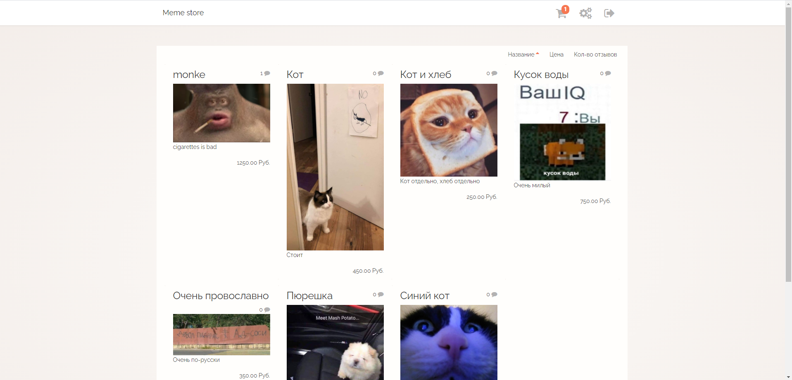

# Simple e-commerce website on Laravel with Vue

    

## Features:
- Registration/authorization
- Products catalog with pagination and sorting
- Basic review system
- Order creating
- Payments via walletone
- Admin panel:
  - Managing products 
  - Moderating reviews
  - Orders viewing
- Animated notifications on action
- And just some fancy transition animations 

## How to run
To run you need some server (open server, for example), and mysql db.  
DB settings are stored in `.env`, sql dump in `misc/tdb_stajer_khram.sql`.